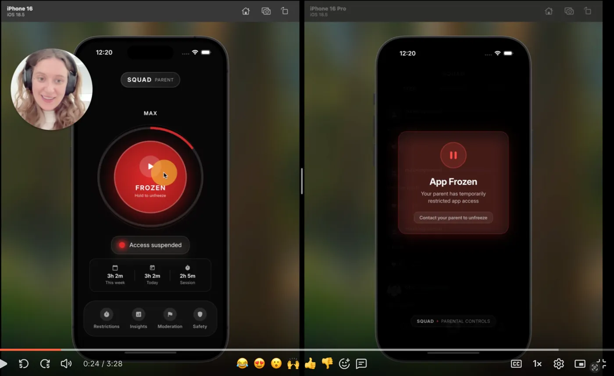
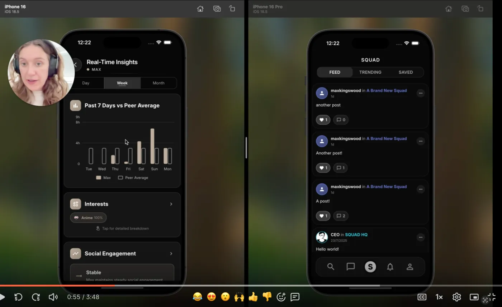

# SQUAD & SQUAD Parent

A dual-app system designed to create safer social media experiences for young people while giving parents meaningful oversight and control.

## Demo

📹 [Watch the full walkthrough](https://www.loom.com/share/374ffc89da414cb68104330fb6fdda66)

  
  

## The Problem

Social media platforms aren't built with youth safety as a priority, and parents lack effective tools to monitor and support their children's online experiences without invading privacy.

## The Solution

Two companion apps that work in tandem:

**SQUAD (Youth App)**
- Age-appropriate social features
- Built-in content moderation
- Transparent parental oversight

**SQUAD Parent**
- Real-time activity insights
- Usage analytics vs peer averages
- Remote app controls (pause/freeze access)
- Interest tracking
- Social engagement monitoring

## Key Features

### Multi-Layer Safety System

1. **Age Verification:** Persona facial scanning during account creation ensures only under-18 users can access SQUAD
2. **Automated Content Moderation:** Sightengine API screens all content before it reaches users
3. **Human Review:** Flagged content routes to a custom moderation dashboard for manual review
4. **Real-Time Parental Controls:** Parents can freeze app access instantly when needed

### Parental Insights

- **Usage Analytics:** Compare child's screen time against peer averages
- **Interest Tracking:** Understand what topics engage your child
- **Social Engagement:** Monitor interaction patterns without reading private messages
- **Activity Status:** See when your child is actively using the app

### Built For Trust

The system is designed around transparency - young people know parents have oversight, and parents get meaningful insights without invasive message reading.

## Technical Architecture

**Frontend**
- Flutter for both mobile applications
- Cross-platform (iOS/Android)

**Backend**
- Firebase for real-time data sync
- Firebase Authentication for user management
- Cloud Firestore for data storage

**Safety & Compliance**
- Persona API for age verification
- Sightengine API for content moderation
- Custom moderation dashboard (local HTML interface)

**Additional Integrations**
- Resend API for email notifications
- Spotify API for music sharing features
- Discord/Railway for customer support queries

## How It Works

1. Youth downloads SQUAD and verifies age via facial scanning
2. Parent downloads SQUAD Parent and links to child's account
3. All content goes through Sightengine before appearing in feeds
4. Flagged content routes to moderation dashboard
5. Parents receive real-time insights and modular controls to fully customise the child's experience.

## Technical Challenges Solved

**Real-Time Sync:** Firebase's real-time capabilities enable instant parent-child account syncing and live activity monitoring

**Content Moderation Pipeline:** Built a multi-stage moderation system that balances automation with human judgment for edge cases

**Privacy vs Oversight:** Architected data access to give parents insights without compromising youth privacy (usage patterns, not message content)

**Cross-App Communication:** Enabled seamless communication between two separate apps while maintaining security boundaries

## Project Status

Built as an exploration of youth safety in social media. The apps demonstrate working age verification, content moderation, and parental oversight features.

**Note:** This is a demonstration project not currently accepting users.

## Architecture Decisions

**Why Firebase?** Real-time sync was critical for parental oversight features, and Firebase provided the simplest path to reliable cross-app communication.

**Why separate apps?** Psychological boundary - keeping parent and child experiences completely separate creates healthier dynamics than a unified interface.

**Why local moderation dashboard?** During development, a simple HTML dashboard was faster to iterate on than building a full web app for the relatively small moderation workload.

## Tech Stack Summary

- **Mobile:** Flutter
- **Backend:** Firebase (Authentication, Firestore, Cloud Functions)
- **APIs:** Persona (age verification), Sightengine (content moderation), Resend (email), Spotify (music)
- **Moderation:** Custom HTML dashboard

---

Built by [Hannah Kingswood](https://github.com/HT1994378)
